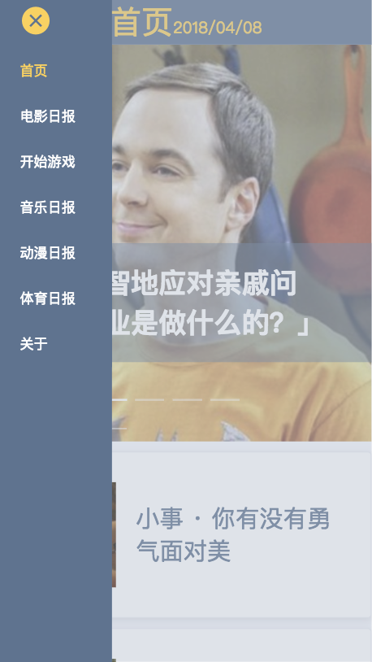

# vue-zhihu
使用vue+elementUI构建的知乎日报
        vue是近期一个火热的前端框架，以其简易，高效为受广大开发者喜爱。
        elementUI是饿了么开源的一个vue组件库，使用elementUI避免重复造轮子，提高开发效率，elementUI除了vue也有react的组件库。
        今天我们就用这两个框架来开发一个PC端的知乎日报。
        声明：『知乎』是 知乎. Inc 的注册商标。本软件与其代码非由知乎创作或维护。软件中所包含的信息与内容皆违反版权与知乎用户协议。它是一个免费软件，使用它不收取您任何费用。其中的所有内容均可在知乎获取。本项目所用API均来自知乎日报真实数据，只用于学习目的，获取与共享之行为或有侵犯知乎权益的嫌疑。若被告知需停止共享与使用，本人会及时删除此页面与整个项目。

vue：https://cn.vuejs.org/v2/guide/ 

elementUI：http://element-cn.eleme.io/#/zh-CN/component/installation
# Vue
vue是一套用于构建用户界面的渐进式框架，关注视图层，易于上手。

# 1.单文件组件
在vue中开发组件可以使用以下方式：
## 全局组件：
    // 创建根实例
    new Vue({
      el: 'App'
    })
    // 注册组件
    Vue.component('helloworld', {
      template: '
一个vue全局组件
'
    })
    // 使用组件
    

      <helloworld></helloworld>
    

## 局部注册
局部注册即是在某个组件实例中注册子组件，在父组件中的components属性中配置即可：

    var hi = {
      template: '你好'
    }
    // 注册组件，挂载之后页面将会显示：hi，你好
    new Vue('helloWorld', {
      template: 
hi,<child></child>

      components: {
        child: hi
      }
    })
在实际项目开发中常常使用**单文件组件**进行开发，单文件组件有固定的模板(`style`标签可以省略)，以.vue为文件扩展名，vue会自动处理.vue文件扩展名的文件，以下使用一个hhelloworld.vue组件来详细了解Vue的单文件组件开发：
    
    // 样式部分
    

    // 模板部分
    <template>
      

    </template>

    // js部分
    

在介绍完Vue的一些特性后，我们来看看我们要做的到底是什么？
# UI设计

我们的UI设计如下所示：
可以看出，我们的项目功能点包括：
  
  * 首页轮播
  * 首页列表
  * 列表项可点击进入详情
  * 主题日报，分为：电影日报、开始游戏、音乐日报、动漫日报、体育日报
  * 关于我们
  * 文章详情
  * 菜单

# 2. 准备工作
## 2.1 安装Vue相关工具
    // vue-cli为vue官方的一个脚手架，用于快速搭建vue项目，全局安装vue-cli，这样才能使用vue命令创建项目。
    npm install -g vue-cli
    // 创建项目，这里会使用vue预先提供好的模板构建项目结构
    vue init webpack my-project
## 2.2 项目的初始化配置

初始化项目完成后，会自动执行npm install相关依赖。当然，你也可以稍后再执行这个命令。

## 2.3 项目目录结构
    
      ├─.babelrc
      ├─.editorconfig
      ├─.eslintignore
      ├─.eslintrc.js
      ├─.gitignore
      ├─.postcssrc.js
      ├─README.md
      ├─index.html  // 入口文件
      ├─package.json
      ├─static  // 静态资源文件夹
      |   └.gitkeep
      ├─src   // 项目源代码
      |  ├─App.vue  // 入口组件
      |  ├─main.js   // 程序入口文件，处理整个项目的相关依赖
      |  ├─router
      |  |   └index.js
      |  ├─components
      |  |     └HelloWorld.vue
      |  ├─assets
      |  |   └logo.png
      ├─config  // 项目开发环境配置
      |   ├─dev.env.js // 开发环境配置
      |   ├─index.js    // 基本配置
      |   ├─prod.env.js // 生产环境配置
      |   └test.env.js  // 测试环境配置
      |—node_modules 
      ├─build           //webpack相关代码
      |   ├─build.js
      |   ├─check-versions.js
      |   ├─logo.png
      |   ├─utils.js
      |   ├─vue-loader.conf.js
      |   ├─webpack.base.conf.js  // webpack基本配置
      |   ├─webpack.dev.conf.js   // webpack开发环境配置
      |   └webpack.prod.conf.js    // webpack生产环境配置 

依赖安装完之后，我们进入项目根目录，执行`npm run dev`命令，启动项目，将显示如下页面：

## 2.4 安装其他依赖：
接下来，安装项目的其他依赖

    //其中：axios用于处理api请求，babel-polyfill用于兼容低版本的浏览器，vuex为vue官方的状态管理器，lodash为前端工具函数库，moment为时间日期处理库
    npm install element-ui axios babel-polyfill vuex lodash moment
    // 安装less
    npm install less less-loader

**配置Less**

`less`安装完成之后需要进行配置才能在项目中使用less。

在`build/webpack.base.conf.js`文件中`module.exports`对象中的`module.rules`添加一段：

    {
      test: /\.less$/,
      loader: "style-loader!css-loader!less-loader",
    }
**配置ElementUI**

按需加载：

借助 [babel-plugin-component](https://github.com/ElementUI/babel-plugin-component)，我们可以只引入需要的组件，以达到减小项目体积的目的。

    npm install babel-plugin-component -D

然后，将 .babelrc 修改为：

    "plugins": [
    "transform-vue-jsx",
    "transform-runtime",
      ["component",
        {
          "libraryName": "element-ui",
          "styleLibraryName": "theme-chalk"
        }
      ]
    ],
这样，我们在项目中就能根据业务需求，按需引入elementUI的部分组件啦~比如：

    import { Button, Select } from 'element-ui';

至此，准备工作完成，接下来我们将从头开始一步一步开发我们的项目。

# 3. 调整项目结构

  对于./build和./config目录我们暂时保持不变，主要对./src源码目录进行了调整。
  
  来看下我们做了哪些新的调整，我们将项目的总体配置：路由，入口文件等统一放置在conf目录下，入口配置文件变更为bootstrap.js，同时新增了server作为存放与后台数据对接的管理目录；page目录为我们的业务代码目录。现在我们只做这一部分的修改，后续还会依据进展再度进行细微调整。

    vue-zhihu
    ├─.babelrc
    ├─.editorconfig
    ├─.eslintignore
    ├─.eslintrc.js
    ├─.postcssrc.js
    ├─README.md
    ├─index.html
    ├─package.json
    ├─test
    |  ├─unit
    |  |  ├─.eslintrc
    |  |  ├─jest.conf.js
    |  |  ├─setup.js
    |  |  ├─specs
    |  |  |   └HelloWorld.spec.js
    |  ├─e2e
    |  |  ├─nightwatch.conf.js
    |  |  ├─runner.js
    |  |  ├─specs
    |  |  |   └test.js
    |  |  ├─custom-assertions
    |  |  |         └elementCount.js
    ├─static
    ├─src
    |  ├─main.js
    |  ├─server
    |  |   ├─fetch.js
    |  |   ├─lib
    |  ├─page
    |  ├─conf
    |  |  ├─App.vue
    |  |  ├─bootstrap.js
    |  |  ├─store
    |  |  |   └index.js
    |  |  ├─router
    |  |  |   ├─base.js
    |  |  |   └index.js
    |  ├─components
    |  |     └HelloWorld.vue
    |  ├─assets
    |  |   └logo.png
    ├─config
    |   ├─dev.env.js
    |   ├─index.js
    |   ├─prod.env.js
    |   └test.env.js
    ├─build
    |   ├─build.js
    |   ├─check-versions.js
    |   ├─utils.js
    |   ├─vue-loader.conf.js
    |   ├─webpack.base.conf.js
    |   ├─webpack.dev.conf.js
    |   └webpack.prod.conf.js

# 4. 配置路由

## 4.1 配置路由
根据UI设计，我们为页面配置了四个路由：
包括首页、日报类型、文章详情和关于我们。
形如：

    // 不同的是path路径和name名称
    {
        path: '/',
        name: 'main',
        component: (resolve) => {
          require(['../../page/main/main.vue'], resolve);
        },
    },

然后配置一个404页面，用来处理路由不存在的情况：

    const routerList = [];

    // 默认 404
    routerList.push({
      path: '*',
      name: 'notFound',
      component: (resolve) => {
        require(['../../page/404/404.vue'], resolve);
      },
    });

    export default routerList;
这样，我们的路由就配置好了。

## 4.2 处理跨域问题

因为我们的API接口是来自知乎的真实数据，需要进行跨域处理，在`config`目录的`index.js`中（该目录及文件是由脚手架生成）,配置如下字段：在这里我们只配置了开发环境下的代理，如需打包项目处理跨域问题需要配合nodejs
进行处理，这里不做展开。

    proxyTable: {
        '/readapi': {
          target: 'https://news-at.zhihu.com',
          changeOrigin: true,
          pathRewrite: {
            '^/readapi': '',
          }
        }
    },

在请求api之前，我们还需要使用axios来创建一个实例，进行统一管理api请求，在`src/server`目录新建`fetch.js`文件，其内容如下：

    import axios from 'axios';

    // 公共api
    const commApi = axios.create({
      baseURL: '/readapi/api',
    });

    // newsApi响应拦截
    const newsResponesInter = (response) => {
      let data;
      if (response.status === 200 && response.statusText === 'OK') {
        data = response.data;
      }
      return data;
    };

    // newsApi请求拦截
    const newsRquestInter = (error) => {
      return Promise.reject(`网络异常: ${error}`);
    };

    commApi.interceptors.response.use(newsResponesInter, newsRquestInter);

    export default commApi;

## 4.3 处理知乎图片防盗链

处理api数据的跨域问题后，我们还需要处理图片的防盗链问题，这是知乎为了防止图片被外部使用的一种处理，如果我们单从浏览器访问图片是不会处理这个问题的。处理这个问题我们只需要在入口文件`index.html`中添加以下代码即可：

    <meta name="referrer" content="never">

详细的知识原理请参考：[知乎日报 API的图片盗链问题](https://www.cnblogs.com/dongcanliang/archive/2017/04/01/6655061.html)

# 5. 开发菜单及对应路由切换

现在我们来构建项目页面的基本结构，同时配置菜单，
在`src/page`目录，该目录存放项目的功能模块；新建一个`index.js、layout.vue和menu-bar目录`。

