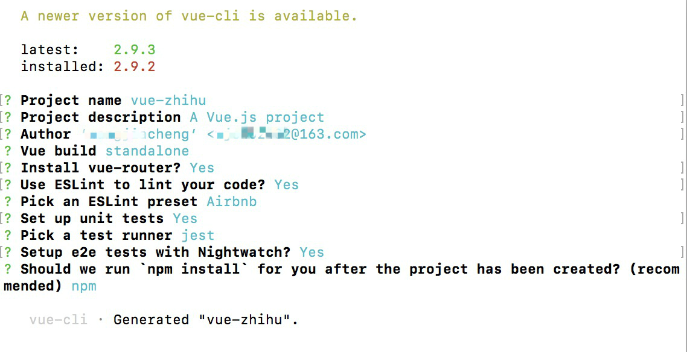

# 3. 准备工作
* ## 3.1 构建项目

vue-cli为vue官方的一个脚手架，用于快速搭建vue项目，全局安装vue-cli，这样才能使用vue命令创建项目。
```
npm install -g vue-cli
```

创建项目，这里会使用vue预先提供好的模板构建项目结构
```
vue init webpack my-project
```
* ## 3.2 项目的初始化配置

初始化项目完成后，会自动执行`npm install`相关依赖。当然，你也可以稍后再执行这个命令。



在这个配置中我们使用了ESLint 的Airbnb代码规范，遵循一定的代码规范有利于团队开发，要养成编码的良好规范哦~

* ## 3.3 项目目录结构

初始化项目完成后我们来看一下项目的初始目录结构；

      ├─.babelrc
      ├─.editorconfig
      ├─.eslintignore
      ├─.eslintrc.js
      ├─.gitignore
      ├─.postcssrc.js
      ├─README.md
      ├─index.html  // 入口文件
      ├─package.json
      ├─static  // 静态资源文件夹
      |   └.gitkeep
      ├─src   // 项目源代码
      |  ├─App.vue  // 入口组件
      |  ├─main.js   // 程序入口文件，处理整个项目的相关依赖
      |  ├─router
      |  |   └index.js
      |  ├─components
      |  |     └HelloWorld.vue
      |  ├─assets
      |  |   └logo.png
      ├─config  // 项目开发环境配置
      |   ├─dev.env.js // 开发环境配置
      |   ├─index.js    // 基本配置
      |   ├─prod.env.js // 生产环境配置
      |   └test.env.js  // 测试环境配置
      |—node_modules 
      ├─build           //webpack相关代码
      |   ├─build.js
      |   ├─check-versions.js
      |   ├─logo.png
      |   ├─utils.js
      |   ├─vue-loader.conf.js
      |   ├─webpack.base.conf.js  // webpack基本配置
      |   ├─webpack.dev.conf.js   // webpack开发环境配置
      |   └webpack.prod.conf.js    // webpack生产环境配置
* ## 3.4 安装ElementUI等依赖

  在经过初始化项目的`npm install`之后，我们还需要安装一些项目必须的重要依赖。

在下面这句命令中

[elelmentUI](http://element-cn.eleme.io/#/zh-CN/component/installation)是饿了么出品的基于Vue的组件库，同时也有基于React和angular的组件库。

[axios](https://github.com/axios/axios)用于处理api请求;

[babel-polyfill](https://babeljs.cn/docs/usage/polyfill/)用于兼容低版本的浏览器;

[vuex](https://vuex.vuejs.org/zh-cn/)为vue官方的状态管理器;

[lodash](https://www.lodashjs.com/docs/4.17.5.html)为前端工具函数库，[moment](http://momentjs.cn/)为时间日期处理库;
```
npm install element-ui axios babel-polyfill vuex lodash moment
```
安装[less](http://lesscss.cn/):
```
npm install less less-loader
```
* ## 3.5 启动项目

  依赖安装完之后，我们进入项目根目录，执行`npm run dev`命令启动项目，将显示如下页面：


下一节：<a href="./配置相关依赖.md">配置相关依赖</a>